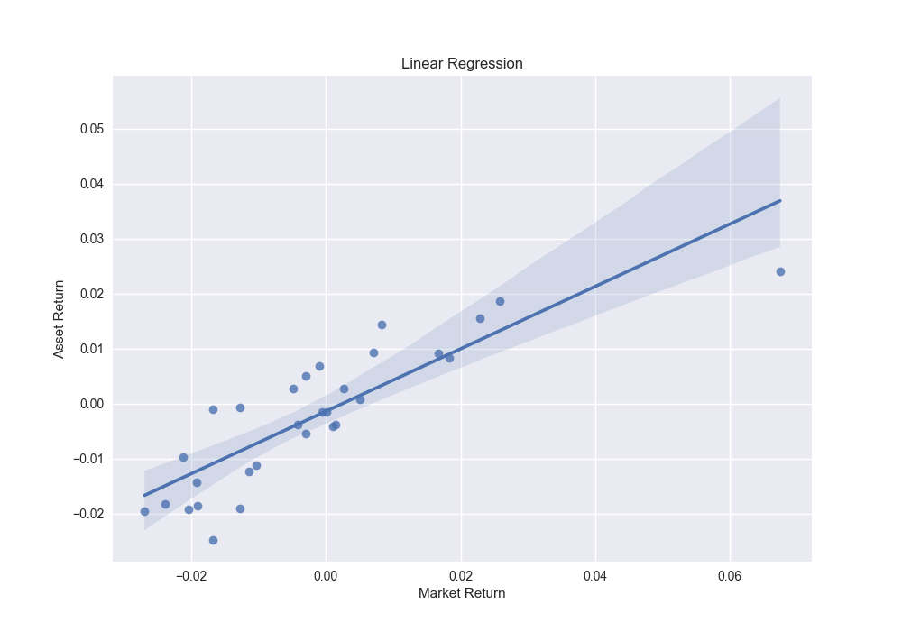

# **Event Studies**

Created at: march/2022

---

## **A Financial Econometrics Model**

The event-study methodology has been applied to measure the impact on the value of a firm due to an specific event. It can be a change in the regulatory environment or black swan occurrences, for example.

In this project, the event is the Russia's invasion of Ukraine, on 24 February 2022. We are going to analise empirically the impact of this event on the stock market prices on Nasdaq Stock Exchange's companies.

---

## **Metodology**

Foram consideradas as seguintes premissas:
- **Janela de estimação**: 150 dias 
- **Janela de evento**: 25 dias.
- **Variável independente**: Índice Nasdaq-100 (^NDX)
- **Variável dependente**: empresas que compõem o índice Nasdaq-100 e que interromperam completamente as suas atividades na Rússia (Withdrawal label), após a abertura do conflito com a Ucrânia. 
    - Airbnb (ABNB), 
    - Autodesk (ADSK), 
    - Advanced Micro Devices (AMD), 
    - Activision Blizzard (ATVI), 
    - Booking Holdings (BKNG), 
    - eBay (EBAY), 
    - Fortinet (FTNT), 
    - Netflix (NFLX)

**Representação Temporal do Evento**:

Uma vez coletados os dados necessários, vamos partir para a mensuração dos retornos normais e anormais. A fórmula abaixo será aplicada para o cálculo do retorno anormal, que é definido pela diferença entre o retorno observado e o retorno estimado pelo modelo que foi aplicado à janela de estimação.

$$ AR_{i\tau} = R_{i\tau} - E(R_{i\tau}|f_\tau)$$

Utilizaremos o modelo base do CAPM da firma i no periodo $\tau$ a estimação:

$$ E(\hat{R}_{i\tau}) = \hat{\alpha} + \hat{\beta}E(R_{m\tau})$$

Em seguida serão calculados os retornos anormais acumulados:

$$ CAR_i(\tau_1, \tau_2) = \sum_{\tau=\tau_1}^{\tau_2} AR_{i\tau}$$

A anormalidade será identificada pelo valor de CAR, caso este seja significativo e diferente de zero. 

Finalmente, será realizado o teste de hipóteses. A hipótese nula é de que não existe retornos anormais e retornos anormais acumulados.

---

## **Results and Discussion**

### Linear Regressions

Após calculados os retornos da janela de estimação, devemos avaliar se o resultado das regressões é satisfatório e estatísticamente adequado para prosseguir com a metodologia. 

O objetivo é estimar o comportamento da ação dado um índice de mercado.

Para isso, o modelo de regressão linear abaixo foi replicado para 30 empresas.
$$ RA_i = {\beta}_0 + {\beta}_1 RN_i + {\epsilon}_i $$
Em que $ RA_i $ é o i-ésimo retorno do ativo estudado e $ RN_i $ é o i-ésimo retorno do índice Nasdaq-100.

Os retornos foram calculados a partir da fórmula:

$$ R_i = \ln \left( \frac{P_{t}}{P_{t-1}} \right) $$

O gráfico acima apresenta o histograma dos retornos diários da ação escolhida e do índice de mercado. É possível observar um comportamento normal de ambas as variáveis.

A imagem abaixo apresenta a representação gráfica da regressão estudada. É possível observar o comportamento linear de ambas as variáveis e uma afinidado ao comportamento homocedástico.

Por fim, é possível avaliar graficamente a sugestão de comportamento normal dos resíduos da regressão.
Este comportamento, no entanto, não é suficiente para afirmar esta normalidade. Alguns testes são realizados a seguir para aferir a robustez do modelo.

