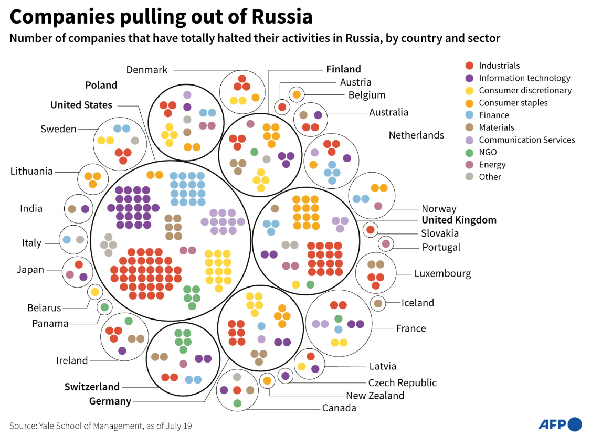

# **Multiple Linear Regression: Model and Tests**

Created at: march/2022

---

## **Resumo**

O objetivo é estudar o modelo de regressão linear múltipla de séries temporais. 

Exemplo: como a taxa de retorno de um ativo se comporta com relação ao mercado.

- **Variável dependente**: Índice Nasdaq-100 (^NDX)
- **Variáveis independentes**: empresas que compõem o índice Nasdaq-100 e que interromperam completamente as suas atividades na Rússia (Withdrawal label), após a abertura do conflito com a Ucrânia. 
    - Airbnb (ABNB), 
    - Autodesk (ADSK), 
    - Advanced Micro Devices (AMD), 
    - Activision Blizzard (ATVI), 
    - Booking Holdings (BKNG), 
    - eBay (EBAY), 
    - Fortinet (FTNT), 
    - Netflix (NFLX)
- **Período contemplado**:
    - Primeira Janela: 30/01/2022 a 23/02/2022
    - Segunda Janela: 24/02/2022 a 20/03/2022
- **Formatação do modelo**:
$$ RI_{market} = f(R_{stock})$$ $$ ndx = \beta_0 + \beta_1abnb + \beta_2adsk + ... + \beta_8 nflx + \mu $$ Em que o termo de erro $\mu$ ou resíduo é a diferença entre o valor real e o valor previsto de Y.
$$ \mu = Y - \^Y$$
Além disso, duas condições devem ser respeitadas:
    - O somatório dos resíduos deve ser igual a zero $$ \sum\mu = 0 $$
    - O somatório dos quadrados dos resíduoes deve ser mínimo $$ \sum\mu^2 = min $$

---
## **Dataset**

Jeffrey Sonnenfeld and his team of experts, research fellows, and students at the Yale Chief Executive Leadership Institute are continue updating a  [list](https://www.yalerussianbusinessretreat.com/) with the announcements of companies that are leaving or staying in Russia.

The file **companies.xlsx** contains the database extracted for this study at august 4th, 2022.

After the announcements of Russian attack to Ukraine and the consequent sanctions on the Russian economy, firms with operations in the country had to decide between stay or leave. 

If a firm continue the operations as before, could lead with a negative image depending on the geopolitical economy side. The companie can also have problems with the cashflow local currency, due to Ruassian currency decrease. 

If a firm decide to withdraw from Russia, there are hard consequences too, loosing costumers and investitors, through the interruption on the cashflow and long-term returns. This is a radical decision that can not be easily reveted. 

A third possibility is to buy time and posptone a final decision to wait for the dust to settle. 

Regarding this context, there are five categories of decision-making:
- **Digging In**: companies that are just continuing business-as-usual in Russia;
- **Buying Time**: companies postponing future planned investment/development/marketing while continuing substantive business;
- **Scaling Back**: companies that are scaling back some significant business operations but continuing some others;
- **Suspension**: companies temporarily curtailing most or nearly all operations while keeping return options open;
- **Withdrawal**: companies totally halting Russian engagements or completely exiting Russia.

---
## **Resultados**

### Passo 1 - Explorar a base de dados

