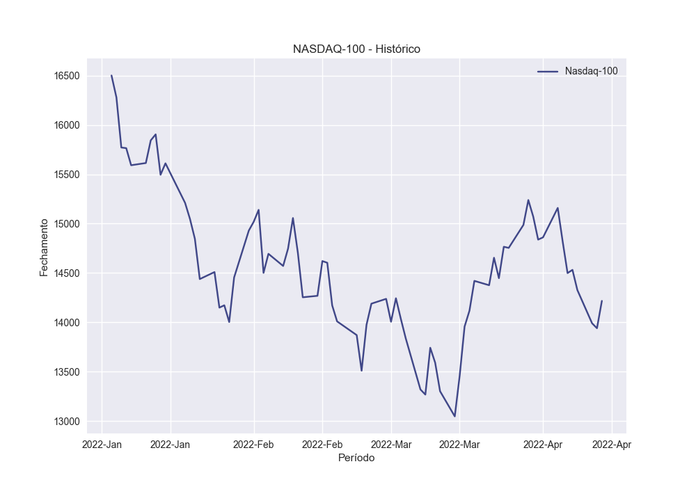

## TCC - Mapa mental e resultados do modelo

20 de março de 2022
Erika Timo de Oliveira - 18/0119567

---

#### Premissas

Vamos considerar as empresas que fazem parte da composição do índice da Nasdaq.
Para isso, utilizei os documentos [Nasdaq Index Methodology Guide](https://indexes.nasdaqomx.com/docs/Nasdaq_Index_Methodology_Guide%20(1).pdf) e [Calculation Manual Equities and Commodities](https://indexes.nasdaqomx.com/docs/Calculation_Manual_Equities_and_Commodities.pdf) para verificar as metodologias utilizadas para a composição do índice. O mais importante é conferir quais são as empresas utilizadas nessa composição e se há algum critério de exclusão que possa enviesar o estudo.

Temos dois índices para a Nasdaq: o Nasdaq Composite e o Nasdaq 100. Inicialmente, a minha intuição revela que o índice Nasdaq-100 é mais interessante por possuir um maior percentual de empresas de tecnologia, mas testarei os resultados com os dois.

No [site da Nasdaq](https://www.nasdaq.com/market-activity/quotes/nasdaq-ndx-index) obtemos todas as empresas que compõem o índice Nasdaq 100.

Utilizei um artigo da [Yale](https://som.yale.edu/story/2022/over-600-companies-have-withdrawn-russia-some-remain) para consultar as empresas que romperam ou manteram relações com a Russia.

O artigo de Yale divide as empresas nas seguintes categorias:
- **Digging In**: empresas que continuam normalmente o seu modelo de negócio usual na Russia.
- **Buying Time**: empresas que adiaram a execução de atividades relacionadas a novos investimentos ou marketing já planejadas, enquanto permanecem operando substancialmente.
- **Scaling Back**: empresas que reduziram algumas operações de maneira significante, mas permanecem com outras.
- **Suspension**: empresas que restringiram temporariamente a operação na Russia, mantendo a opção de retorno em aberto.
- **Withdrawal**: empresas que interromperam completamente as atividades na Russia.

Principais empresas (já cruzando com a base da Nasdaq):
- **Withdrawal**: ABNB, ADSK, AMD, ATVI, BKNG, EBAY, FTNT, NFLX
- **Suspension**: AAPL, ADBE, ADI, ADP, AMZN, ANSS, COST, CSCO, FB, GOOG, GOOGL, HON, INTC, INTU, MRVL, MU, NVDA, PYPL, QCOM, SBUX, TEAM
- **Scaling Back**: MSFT, PEP
- **Digging In**: ALGN, JD, PCAR
- **Buying Time**: AZN, IDXX, KHC, MAR, MDLZ
- **Not Applicable**: AEP, AMAT, AMGN, ASML, AVGO, BIDU, BIIB, CDNS, CEG, CHTR, CMCSA, CPRT, CRWD, CSX, CTAS, CTSH, DDOG, DLTR, DOCU, DXCM, EA, EXC, FAST, FISV, GILD, ILMN, ISRG, KDP, KLAC, LCID, LRCX, LULU, MCHP, MELI, MNST, MRNA, MTCH, NTES, NXPI, ODFL, OKTA, ORLY, PANW, PAYX, PDD, REGN, ROST, SGEN, SIRI, SNPS, SPLK, SWKS, TMUS, TSLA, TXN, VRSK, VRSN, VRTX, WBA, WDAY, XEL, ZM, ZS

O status **Not Applicable** foi dado por mim para as empresas que fazem parte do grupo da Nasdaq, mas não foram citadas no estudo de Yale, por não possuirem operações anteriores ao conflito na Russia.

#### Metodologia

O estudo de análise de eventos é uma das metodologias que podemos utilizar para entender o comportamento do mercado diante de um determinado evento.

Não podemos deixar de citar duas teorias que contribuem fortemente para esta análise:
- Teoria Random Walk 
- Teoria dos Mercados Eficientes

##### Teoria Random Walk

Ou, em português, passeio aleatório. O Random Walk é uma analogia aplicada ao "caminho" que um ativo percorre, conforme se comporta ao longo do tempo. Isto é, partindo de um ponto inicial e dada uma distância fixa, o próximo no caminho é escolhido por meio de uma variação aleatória da direção.

Desse modo, os preços das ações são formados de modo aleatório, imprevisível e independente de movimentos passados. Nenhuma direção possui maior probabilidade de ser escolhida do que as demais.

Um caminho aleatório pode ser obtido através do processo de Markov, que se trata de um método estocástico em que o comportamento de uma variável ao longo do tempo depende unicamente do seu valor inicial, não sendo possível prever os valores futuros com base em dados históricos, Kendall (1953). 

##### Teoria Mercados Eficientes

A Hipótese dos Mercados Eficiêntes, Fama (1973), sugere que o mercado reage de modo imediato a eventos e informações disponíveis publicamente. 

Consequentemente, um mercado é eficiente quando, a partir de informações exclusivamente públicas, não é possível obter retornos superiores aos do mercado, Jensen (1978).

Deste modo, uma anomalia no comportamento de um mercado por ser identificada pela análise do padrão de comportamento deste mercado dado um determinado evento.
A eficiência deste mercado é avaliada conforme a velocidade com que informações relevantes e publicamente disponíveis são absorvidas e refletidas nos preços que o compõem.

A eficiência de mercado é classificada em três categorias Roberts (1967) e Fama (1970):
- **Forte**: o preço reflete toda a informação relevante sobre uma determinada ação. Aqui há a possibilidade de um grupo seleto de investidores possuírem informações privilegiadas e se movimentarem de forta antecipada ao mercado, permitindo a possibilidade de ganhos anormais.
- **Semiforte**: o preço atual da ação reflete instantaneamente as informações públicas presentes no mercado. Ganhos anormais não são possíveis, pois as ações realizadas pelos participantes do mercado acompanham os preços já ajustados à nova informação.
- **Fraca**: o preço atual da ação reflete informações passadas. A informação histórica já igualmente conhecida por todos, o que inviabiliza a possibilidade de ganhos anormais.

##### Teoria Mercados Eficientes

Fama et al. (1970) propõe uma técnica para avaliar a reação do mercado dado um determinado evento.
Para o estudo de eventos pressupõe-se que o mercado se comporte de maneira semiforte, obedecendo à **Hipótese do Mercado Eficiênte**, em que as informações públicas e relevantes são rapidamente absorvidas e refletidas nos preços das ações, impossibilitando o ganho de retornos anormais neste contexto.

Para o estudo de eventos são consideradas 7 etapas, MacKinlay et al (1997):

1) Definição do Evento
2) Seleção da Amostra
3) Retornos normais e anormais
4) Procedimento de estimação
5) Procedimento de teste
6) Resultados empiricos
7) Interpretação e conclusÕes

A definição do evento diz respeito à estruturação do estudo, qual mercado será analisado, em qual contexto e período. 
A janela do evento é o periodo que engloba X dias antes da data do evento ocorrido e X dias depois. A janela de estimação são Y dias anteriores à primeira data da janela do evento. Os dados referentes à janela de estimação são utilizados para entender o comportamento do mercado antes de qualquer influência do evento.

Durante a seleção da amostra define-se os critérios que serão utilizados para a escolha dos ativos ou setores a serem analisados.

Uma vez coletados os dados necessários, a terceira etapa é a mensuração dos retornos normais e anormais. A fórmula abaixo será aplicada para o cálculo do retorno anormal, que é definido pela diferença entre o retorno observado e o retorno estimado pelo modelo que foi aplicado à janela de estimação.

$$ AR_{i\tau} = R_{i\tau} - E(R_{i\tau}|f_\tau)$$

Utilizaremos o modelo base do CAPM da firma i no periodo $\tau$ a estimação:

$$ E(\hat{R}_{i\tau}) = \hat{\alpha} + \hat{\beta}E(R_{m\tau})$$

Em seguida serão calculados os retornos anormais acumulados:

$$ CAR_i(\tau_1, \tau_2) = \sum_{\tau=\tau_1}^{\tau_2} AR_{i\tau}$$

A anormalidade será identificada pelo valor de CAR, caso este seja significativo e diferente de zero. 

Na quarta etapa, é realizado o teste de hipóteses. A hipótese nula é de que não existe retornos anormais e retornos anormais acumulados e o mercado se comporta de forma eficiente. Caso haja uma rejeição de $H_0$, entende-se que houve um comportamento anormal durante o período.

Finalmente, os resultados empíricos deste processo devem ser avaliados e interpretados.

