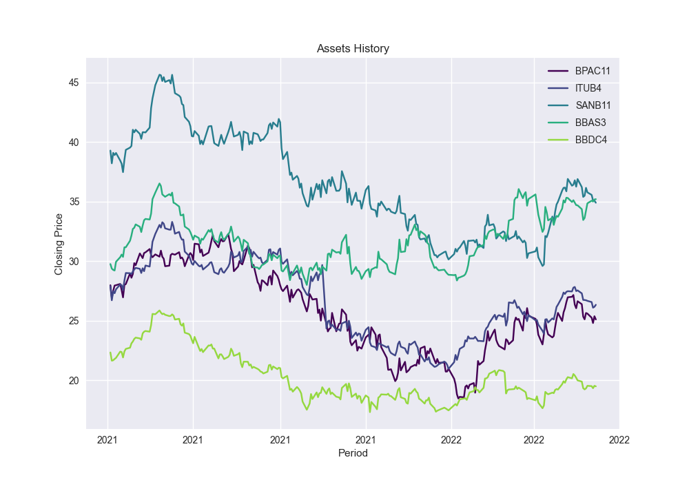
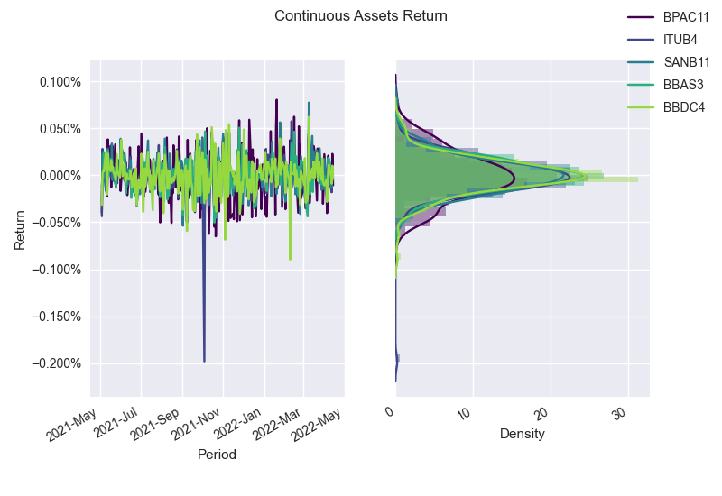
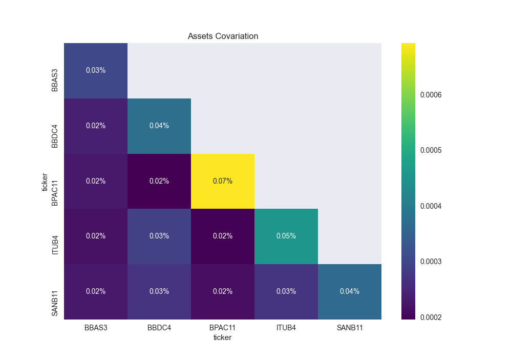
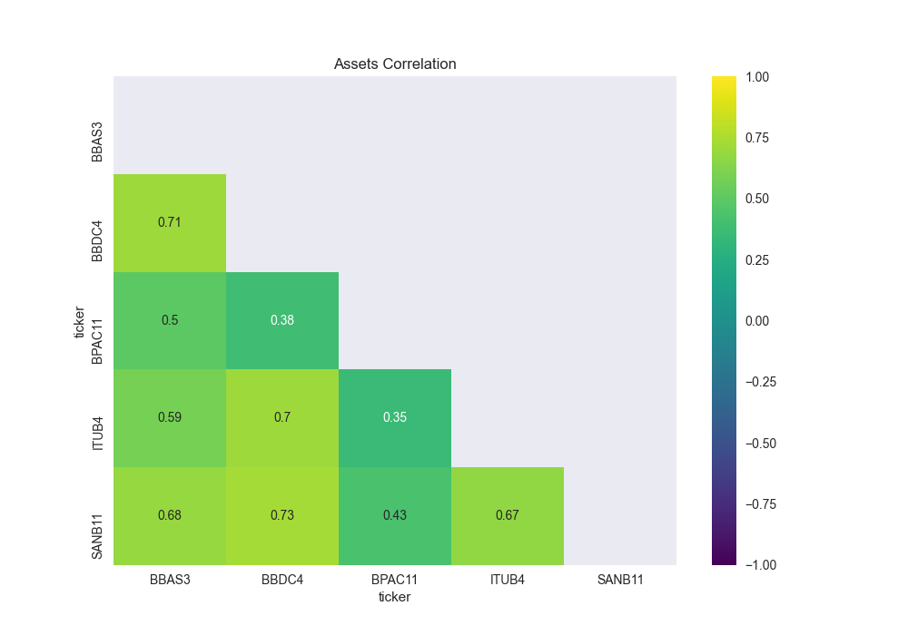
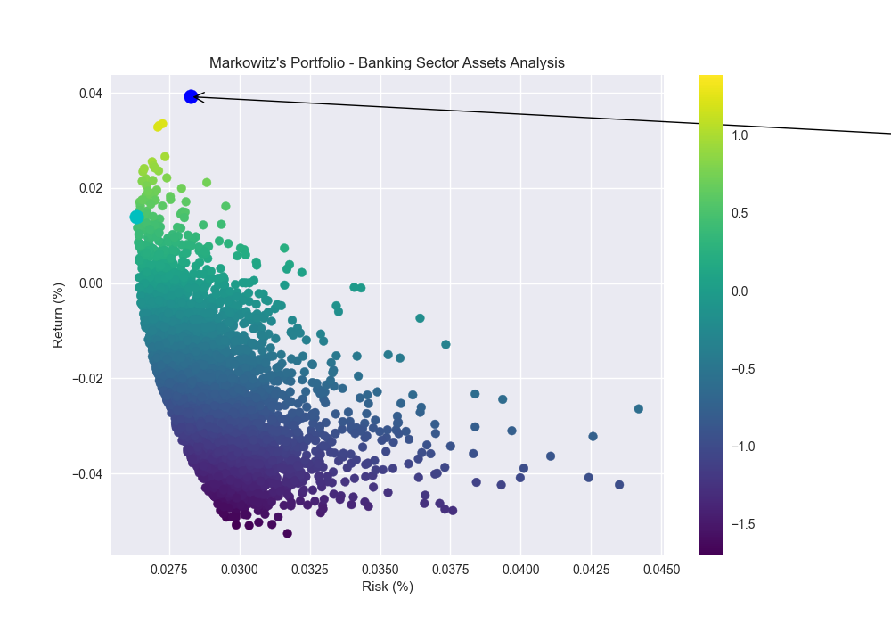
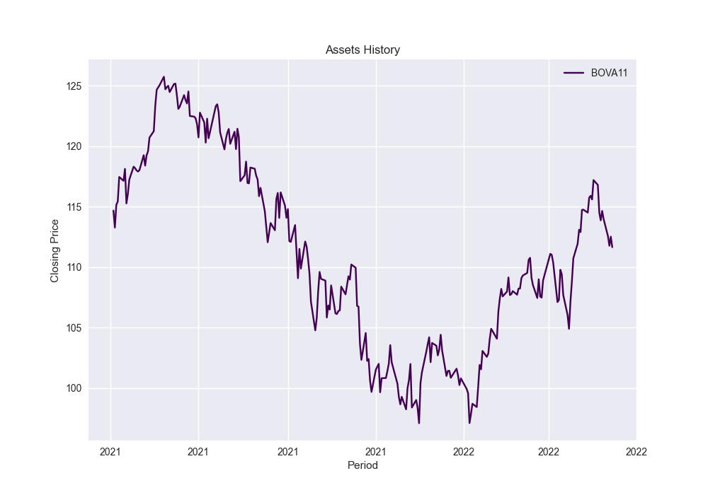
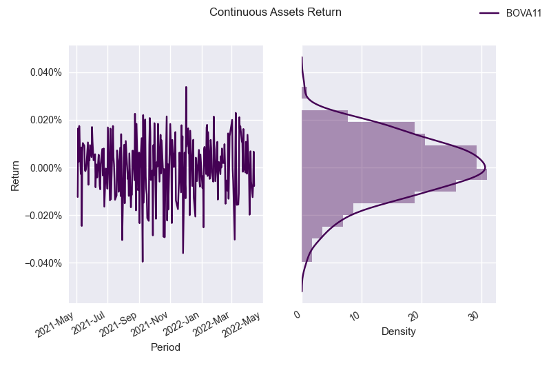
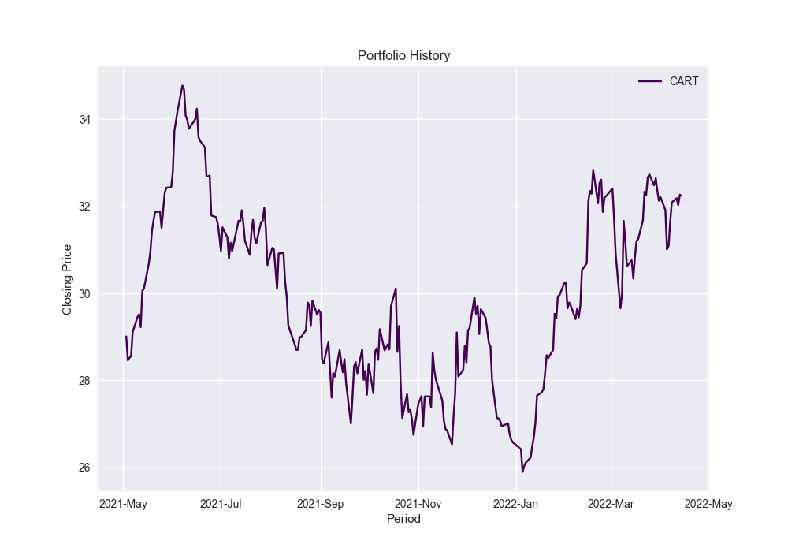
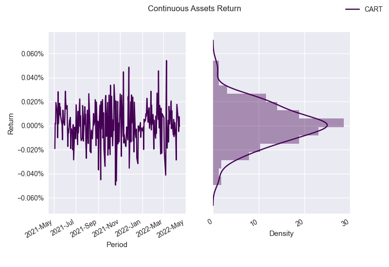
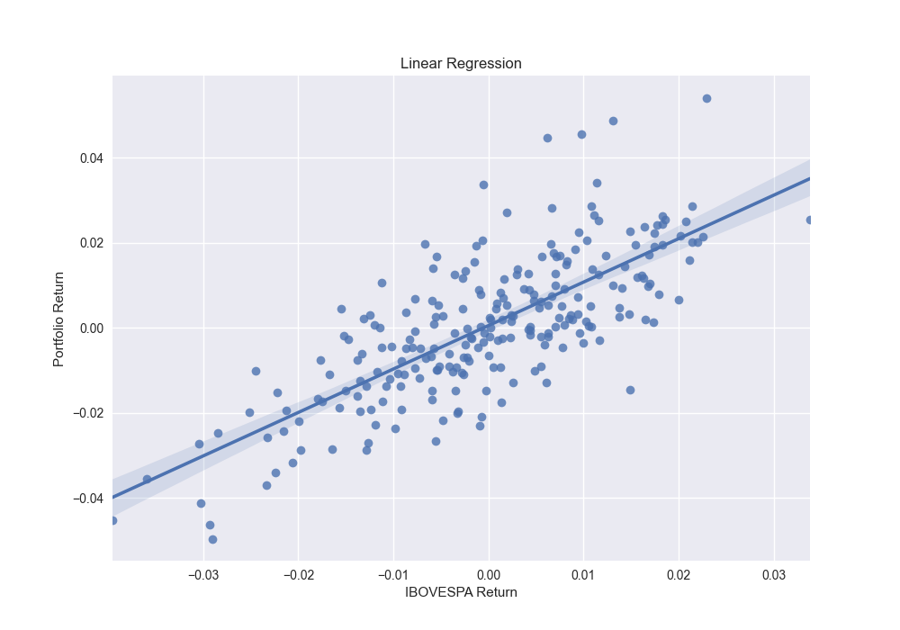

## Gestão de Riscos - 2ª Avaliação

29 de março de 2022

Erika Timo de Oliveira - 18/0119567

Vitor Dolabela - 15/0151594

---

#### Questão 0 - Recordando a 1ª Avaliação
Foram utilizados 5 ativos do setor bancário para a análise solicitada: 
- BPAC11 - BTG PACTUAL
- ITUB4 - ITAÚ UNIBANCO
- SANB11 - SANTANDER
- BBAS3 - BANCO DO BRASIL
- BBDC4 - BRADESCO

Será considerado o período do ano de 2021

Para a coleta de dados foi utilizada a biblioteca **yahooquery**, conforme request modelada na função **get_historical_prices**, que salva os dados históricos do portifólio em uma datafrane e plota o gráfico abaixo na figura **assets_history.png** do diretório.

A base de dados foi exportada para o arquivo **0_data.csv**.

#### Letra A
Cálculo dos Retornos Contínuos Diários de cada ativo, a partir da fórmula abaixo:
$$ ln \left (\frac{P_t}{P_{t-1}} \right)$$
Esta fórmula é modelada na função **return_variation**, que salva os dados de retornos contínuos e discretos em uma dataframe, para cada ativo. Além disso, o gráfico abaixo é plotado na figura **assets_return.png** do diretório.

A partir da visualização acima é possível observar que os retornos obedecem uma distribuição normal para o período apresentado.
O resultado é exportado no arquivo **0_a_results.csv**.

#### Letra B
Cálculo do Retorno Médio e Risco (desvio padrão) de cada ativo.
Para isso, é realizada a média simples e o cálculo do desvio padrão sobre os vetores que contém os retornos diários dos ativos.
O resultado é exportado no arquivo **0_b_results.csv**.

@import "results/questao_0/0_b_results.csv"

#### Letra C
Matriz de variância e covariância do retorno dos ativos no periodo.
Os cálculos das matrizes de correlação e de covariância estão modelados nas funções **return_covariation** e **return_correlation**.

A equação abaixo é utilizada para o cálculo da covariância entre os retornos de dois ativos.

$$ ρ_{ij} = \frac{1}{T} \sum_{t=1}^{T} (R_{i,t}-\=R_i)(R_{j,t}-\=R_j)$$

Os plots abaixo ilustram o resultado e estão salvos no diretório como **assets_covariation.png** e **assets_correlation.png**.

#### Letra D
Encontrar a melhor formação das frações de investimento do risco mínimo destes retornos.
Para isto, a função **random_weights** é utilizada para gerar n pesos aleatórios para a cada um dos ativos pertencentes ao portfolio.
Em paralelo, temos a função **portfolio_performance**, que recebe como argumento um vetor de pesos e retorna o risco e o retorno do portfolio.
Vale lembrar que, de acordo com a teoria de Markowits, o retorno de uma carteira de investimentos é dado pela média ponderada do retorno de cada um dos ativos que a compõe.

$$ R_c = \sum_{i=1}^{N} R_i X_i$$

O cálculo do risco da carteira como um todo, por sua vez, é dado pela fórmula abaixo.

$$ V(R) = \sum_{i=1}^{N} \sum_{j=1}^{N}X_i X_j ρ_{ij} $$

A função **random_portfolio** utiliza as funções **random_weights** e **portfolio_performance** para calcular os resultados de risco, retorno e índice sharpie para n simulações.
Os dados são ilustrados no gráfico abaixo gráfico, plotado na figura **markowits.png** do diretório.

Para o cálculo do índice Sharpie foi considerada uma taxa livre de risco diária de 0,005%

As melhores frações encontradas a partir desta metodologia são:

@import "results/questao_0/0_d_results.csv"

---

#### Questão 1 - Cálculo do CAPM

##### Letra A 

Os gráficos abaixo apresentam o cálculo dos retornos contínuos e valores históricos do índice IBOVESPA.

Os pesos encontrados na questão 0 para o maior índice Sharpie foram utilizados para simular os preços diários de fechamento de uma carteira ideal ponderada.
Os gráficos abaixo apresentam o cálculo dos retornos contínuos e valores históricos da carteira simulada.

Essa carteira simulada com os pesos de Markowits foi exportada para o arquivo **simulated_portfolio_history.csv**, uma vez que será utilizada na questão 1 da lista 2.

##### Letra B 
Regressão de Y (Retorno da carteira) e de X (Retorno do IBOVESPA).

##### Letra C 
Encontrar o β da Regressão

@import "results/questao_1/1_c_results.csv"

##### Letra D - Cálculo do CAPM com o β da Regressão
O retorno do ativo livre de risco é representado pela taxa SELIC, de 9,5% ao ano.   
A taxa diária equivalente é de 

---

#### Questão 2

Inicialmente, foi projetado um fluxo de caixa em que tanto os preços praticados, quanto a quantidade produzida e os custos variáveis são gerados por meio de distribuição. 

Em seguida, realizou-se o cálculo do VP e do VPL, ao longo de 20 anos, juntamente com os dados iniciais do problema.

Os resultados estão apresentados na **AV2 - Q2** da planilha **AV2 e AV3 - Vitor Dolabela e Érika Timo vf**.

---

#### Questão 3

O cálculo da opção real foi realizado com base nos modelos de Black-Scholes e binomial, cujas fórmulas e cálculos estão indicados na aba **AV2-Q3** da planilha **AV2 e AV3 - Vitor Dolabela e Érika Timo vf**.